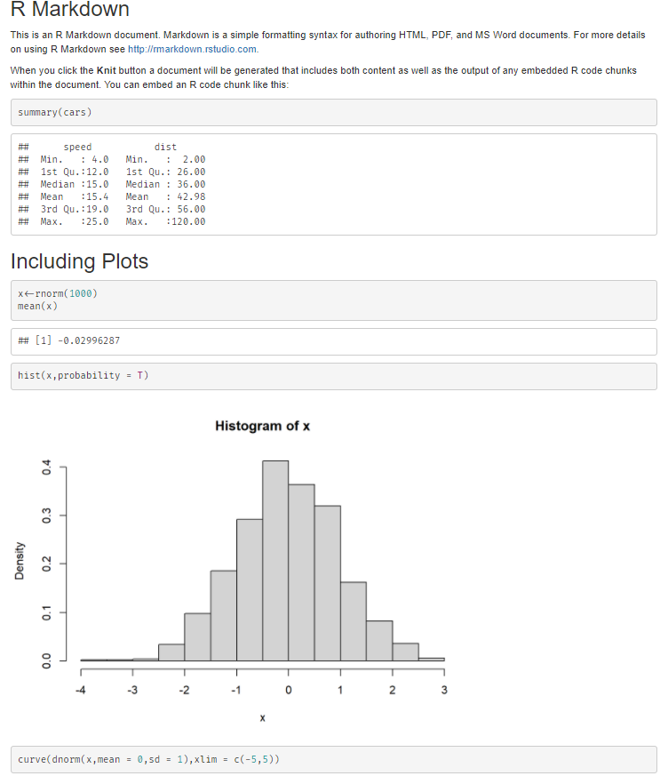
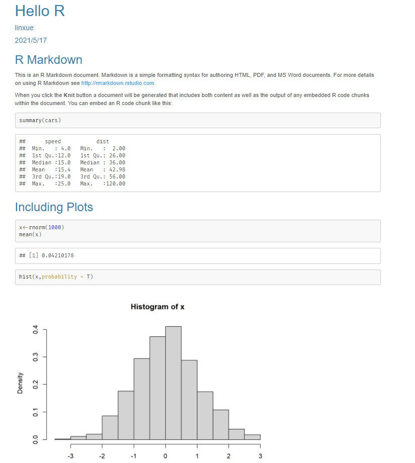
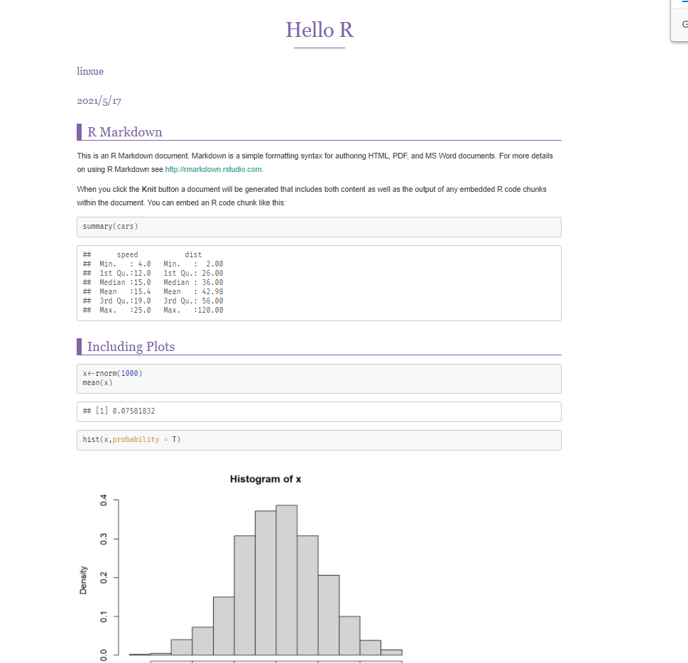

# R Markdown 如何使用外部css

在学习R Markdown的过程中，遇到了一些问题，在这里记录一下。

## 起因
默认输出的样式有点单调，不是很喜欢，想要美化一下

## 解决方法

对于`html_document`输出类型， 可以用`theme`属性设置一个主题， 取值如default, cerulean, journal, flatly, darkly, readable, spacelab, united, cosmo, lumen, paper, sandstone, simplex, yeti。

用`highlight`属性设置程序语言语法高亮样式， 可取值有default, tango, pygments, kate, monochrome, espresso, zenburn, haddock, and textmate。 用`null`表示取消语法高亮。

可以用`css`属性指定一个自定义的CSS样式表文件。 如果希望完全用自己的样式代替原有样式， 可以设置`theme: null`。

## 示例

1. 默认输出



2. theme+highlight
```r
---
title: "Hello R"
author: 'linxue'
date: "2021/5/17"
output:
  html_document:
    theme: cerulean
    highlight: tango
---
```


**注意：**这种方式的html**打印颜色不显示**，原因未知

3. css +highlight




```r
---
title: "Hello R"
author: 'linxue'
date: "2021/5/17"
output:
  html_document:
    css: css/purple.css
    highlight: tango
---
```

注：这里的css可以使用绝对路径

以上操作均可在RStudio knit右边的设置(小齿轮)里的Output Options进行操作

## 参考资料

[R语言教程](https://www.math.pku.edu.cn/teachers/lidf/docs/Rbook/html/_Rbook/rmarkdown.html#rmd-output-htmlspecific)

[typora-purple-theme](https://github.com/hliu202/typora-purple-theme)

